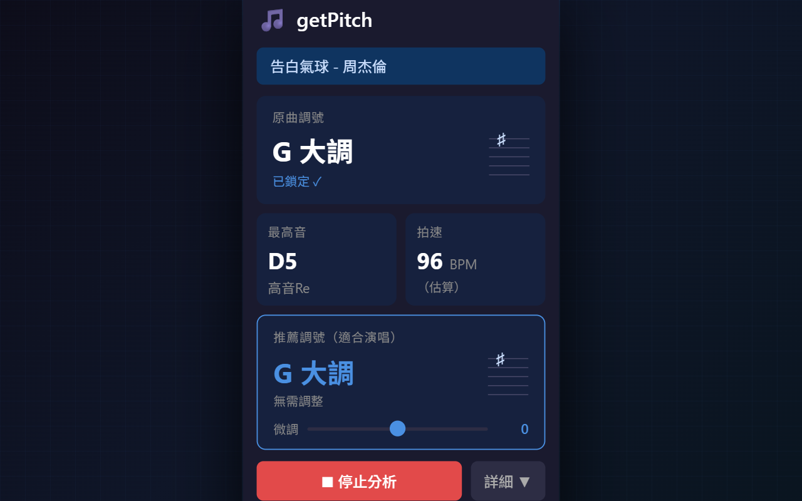
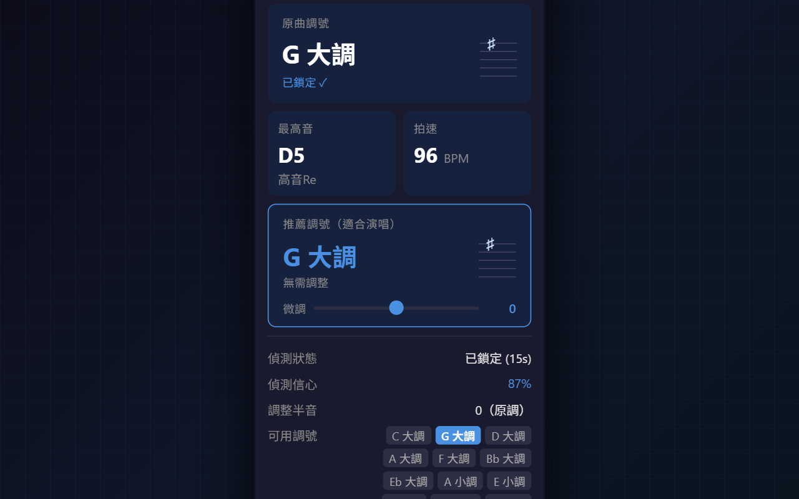
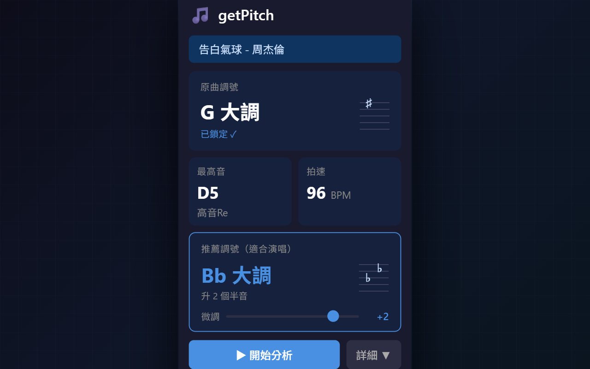

# getPitch — YouTube Key Detector

[](https://github.com/Ikeli0320/getPitch/actions/workflows/ci.yml)
[](CHANGELOG.md)

A Chrome extension that listens to any YouTube song and tells you its **key signature**, **highest note**, **BPM**, and **recommended singing key** — all in real time, entirely in your browser.

## Features

- **Key signature** — locks after ~15 s using Bellman-Budge (1962) chromagram + Pearson correlation. Displayed with staff accidentals (sharps/flats) so it reads like sheet music.
- **Highest note** — continuously tracked with note name (e.g. `D5`) and solfège label (e.g. `高音Re`). Confirms across ≥ 2 of last 3 frames to suppress transients.
- **BPM** — spectral-flux onset autocorrelation; stabilises after ~5 s.
- **Recommended singing key** — picks the key where the highest note lands at or below **D5** with ≤ 3 sharps/flats (14 practical karaoke keys). Includes a **±3-semitone transpose slider** for fine-tuning.
- **Key confidence** — 0–100 score; ⚠ badge shown when ambiguous (< 40).
- **Silent-audio guard** — stops after 20 s of silence with a helpful error message.
- **Privacy** — zero data leaves your browser. No network requests, no telemetry.

## Screenshots

| Main view | Detail panel | Transpose slider |
|-----------|-------------|-----------------|
|  |  |  |

## Install

### From Chrome Web Store *(coming soon)*

Search for **getPitch - YouTube Key Detector** or use the direct link once published.

### Manual (Developer Mode)

1. Clone or download this repo.
2. Open `chrome://extensions/` and enable **Developer mode**.
3. Click **Load unpacked** and select the `getPitch/` folder.
4. Open any YouTube music video and click the getPitch toolbar icon (or press **Alt+P** / **⌘⇧P** on Mac).

## Usage

1. Open a YouTube music video.
2. Click the **getPitch** toolbar icon.
3. Press **▶ 開始分析** (Start Analysis).
4. Watch the key, highest note, BPM, and recommended key populate as the song plays.

## Development

No build step required.

```bash
# Run unit tests
npm test

# Generate icons
node scripts/generate-icons.js

# Rebuild release ZIP (PowerShell)
$ver = (Get-Content manifest.json | ConvertFrom-Json).version
Compress-Archive -Path manifest.json,background,content,popup,icons,privacy-policy.html `
  -DestinationPath "getPitch-$ver.zip" -Force
```

### Architecture

```
content scripts (YouTube page)          background.js        popup.js
  chromagram.js                         ─────────────        ────────
    buildChromagram()                   startAnalysis    →   getState (session)
    accumulateChroma()    content.js    stopAnalysis     →   storage.onChanged →
  key-detector.js         ──────────   updateResults    →     _updateUI()
    detectKey()           _tick()      resetState       →     _renderKeySigSVG()
    recommendKey()        200 ms       getState         ←     _getAdjustedKey()
```

Content scripts are injected declaratively (no `scripting` permission). State lives in `chrome.storage.session` and is restored on MV3 service-worker eviction.

### Key constants

`content/content.js`:

| Constant | Default | Effect |
|---|---|---|
| `KEY_LOCK_MS` | 15 000 | ms of audio before key locks |
| `TICK_MS` | 200 | main analysis interval (ms) |
| `SILENT_TIMEOUT_MS` | 20 000 | ms of near-zero chroma before "no audio" error |
| `NOISE_FLOOR_DB` | −55 | dB threshold for note peak detection |
| `FREQ_MIN_HZ` | 130 | lower bound for note tracking (~C3) |
| `FREQ_MAX_HZ` | 1 175 | upper bound for note tracking (~D6) |
| `ONSET_TICK_MS` | 50 | BPM onset sampling interval (ms) |
| `ONSET_HISTORY_MAX` | 400 | max onset samples (~20 s window) |
| `ONSET_FREQ_MIN_HZ` | 50 | BPM onset band lower bound (kick/bass) |
| `ONSET_FREQ_MAX_HZ` | 500 | BPM onset band upper bound |
| `BPM_MIN` | 60 | autocorrelation search floor |
| `BPM_MAX` | 180 | autocorrelation search ceiling |
| `NOTE_WINDOW` | 3 | rolling frame window for note confirmation |
| `NOTE_MIN_HITS` | 2 | min agreeing frames to confirm a note |

`content/chromagram.js`:

| Constant | Default | Effect |
|---|---|---|
| `CHROMA_FREQ_MIN_HZ` | 130 | lower bound for key-detection chroma (~C3) |
| `CHROMA_FREQ_MAX_HZ` | 1 047 | upper bound for key-detection chroma (~C6, tighter than note tracking to reduce harmonic noise) |

## Troubleshooting

| Symptom | Cause | Fix |
|---------|-------|-----|
| "找不到影片元素" | Extension loaded before video | Refresh the page and try again |
| "請先播放影片" | Video is paused | Press Play, then click ▶ 開始分析 |
| "未偵測到音訊" after 20 s | Video muted, system volume off, or audio-only tab | Unmute the video and verify system volume is on |
| Key stuck at "偵測中..." | Less than 15 s of audio | Wait for the 15-second lock window |
| BPM shows "—" | Less than 5 s of audio collected | Wait ~5 s after starting analysis |
| Extension doesn't open | Extension not loaded | Go to `chrome://extensions`, enable Developer Mode, and load the folder |
| Results from wrong tab | Another YouTube tab is active | Stop analysis on the other tab first |
| ⚠ badge on key | Confidence < 40 — ambiguous chroma | Play through a full verse/chorus for better data |

## Privacy Policy

All audio analysis runs locally in your browser. No audio or personal data is collected or transmitted. See [`privacy-policy.html`](privacy-policy.html) for the full policy.

## License

[MIT](LICENSE)
